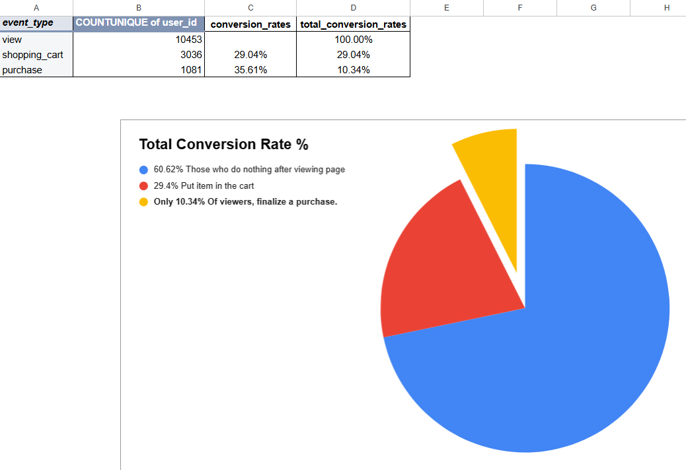
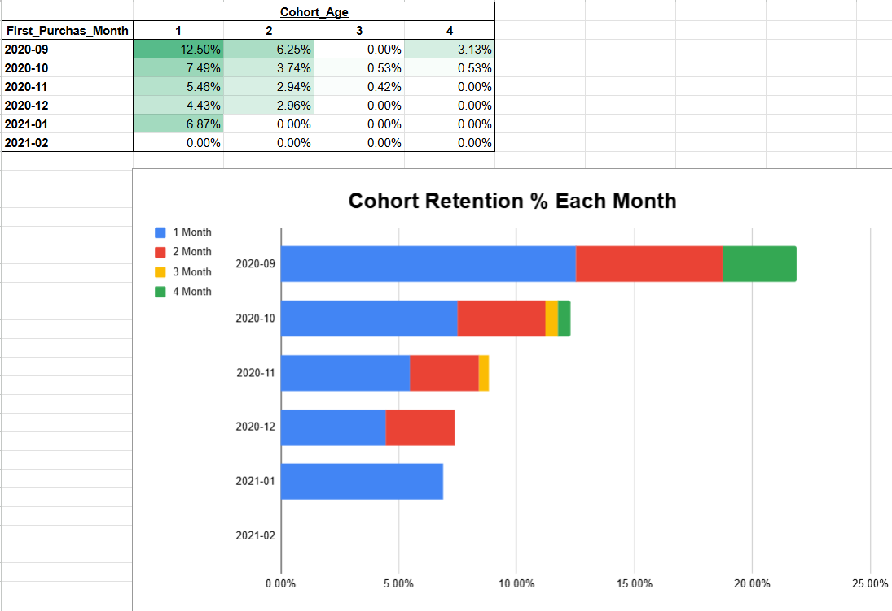
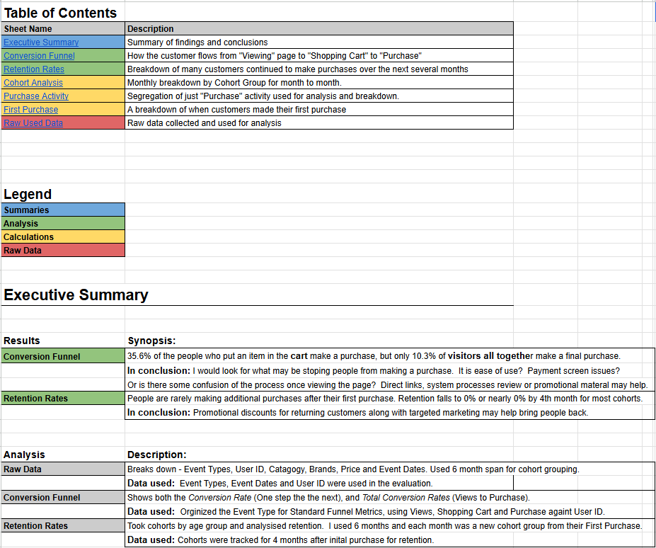

# 📊 Turning Event Logs into Business Metrics  
### E-Commerce Conversion Funnel & Cohort Retention Analysis

---

## 📌 Project Overview

As a Junior Business Analyst, I transformed raw e-commerce transaction logs into structured business metrics to evaluate website performance and customer behavior.

Each row in the dataset represented a user event (product view, shopping cart interaction, or purchase). The primary objectives were to:

- Build a 3-stage conversion funnel  
- Perform cohort analysis based on first purchase month  
- Calculate month-over-month retention rates  
- Deliver executive-ready insights and strategic recommendations  

The analysis was completed using advanced spreadsheet techniques including pivot tables, lookup functions, cohort modeling, and retention rate calculations.

---

## 📂 Dataset Overview

The raw dataset included:

- `user_id`
- `event_type` (view, shopping_cart, purchase)
- `category_code`
- `brand`
- `price`
- `event_date`

The analysis covered a 6-month period of activity and grouped users into cohorts based on their first purchase month.

---

# 🔄 Part 1: Conversion Funnel Analysis

The conversion funnel was constructed using **unique user counts** across three stages:

1️⃣ Product View  
2️⃣ Shopping Cart  
3️⃣ Purchase  

### 📊 Funnel Performance

| Stage | Unique Users | Conversion to Next Step | Total Conversion |
|--------|--------------|------------------------|-----------------|
| View | 10,453 | — | 100% |
| Shopping Cart | 3,036 | 29.04% | 29.04% |
| Purchase | 1,081 | 35.61% | 10.34% |

### 🔎 Key Insights

- Only **29.04%** of visitors add an item to cart.
- Of those, **35.61%** complete a purchase.
- Overall conversion from view to purchase is only **10.34%**.
- Nearly **60% of users drop off immediately after viewing a product page.**

### 📌 Strategic Interpretation

The primary leakage point occurs at the top of the funnel. Product pages may lack clarity, urgency, or trust signals necessary to drive users forward.

---

# 👥 Part 2: Cohort Analysis & Retention Modeling

To evaluate customer longevity:

- Filtered dataset to purchase events only (4,845 records)
- Calculated each user’s **first_purchase_date**
- Created:
  - `event_month`
  - `first_purchase_month`
  - `cohort_age` (months since first purchase)

Six acquisition cohorts were formed based on first purchase month.

---

# 📉 Part 3: Retention Rate Analysis

Retention was measured monthly for each cohort.

### 📊 Observed Retention Patterns

| Cohort | Month 1 | Month 2 | Month 3 | Month 4 |
|--------|----------|----------|----------|----------|
| 2020-09 | 12.50% | 6.25% | 0.00% | 3.13% |
| 2020-10 | 7.49% | 3.74% | 0.53% | 0.53% |
| 2020-11 | 5.46% | 2.94% | 0.42% | 0.00% |
| 2020-12 | 4.43% | 2.96% | 0.00% | 0.00% |
| 2021-01 | 6.87% | 0.00% | 0.00% | 0.00% |
| 2021-02 | 0.00% | 0.00% | 0.00% | 0.00% |

### 🔎 Key Insights

- Retention declines sharply after the first month.
- Most cohorts approach near-zero engagement by month 3–4.
- The earliest cohort (2020-09) shows the strongest relative retention.
- Customer lifetime value appears short without re-engagement efforts.

---

# 📝 Executive Summary & Documentation

The workbook includes:

- Structured table of contents  
- Cleanly documented data preparation steps  
- Clear separation between raw data, calculations, and analysis sheets  
- Executive-level summary of findings  

The spreadsheet was organized for clarity, reproducibility, and stakeholder review.

---

# 💡 Strategic Business Conclusions

## 🚨 Major Funnel Drop-Off
70% of users do not move beyond product viewing.

## 🔁 Weak Customer Retention
Repeat purchase behavior declines significantly after initial purchase.

This suggests acquisition may be working, but long-term engagement strategy is underdeveloped.

---

# 📈 Business Recommendations

### 1️⃣ Improve Product Page Conversion
- Optimize call-to-action placement  
- Clarify pricing and shipping transparency  
- Strengthen trust indicators  

### 2️⃣ Optimize Checkout Experience
- Reduce friction in payment steps  
- Offer guest checkout  
- Audit system performance for drop-offs  

### 3️⃣ Implement Retention Strategy
- Targeted post-purchase email campaigns  
- Incentives for second purchase  
- Loyalty or referral programs  

---

# 🛠 Tools & Techniques Demonstrated

- Excel Pivot Tables  
- COUNTUNIQUE metrics  
- VLOOKUP()  
- TEXT() for monthly grouping  
- DATEDIF() for cohort aging  
- Funnel performance modeling  
- Cohort-based retention analysis  
- Executive reporting and documentation  

---

# 🧠 What This Project Demonstrates

- Ability to convert raw event logs into structured KPIs  
- Funnel performance analysis  
- Cohort-based retention modeling  
- Business interpretation of behavioral metrics  
- Clear, executive-ready communication  

---

## 👤 Author

**Preston Long**  
Business Intelligence Analyst  
LinkedIn: [Preston Long](https://www.linkedin.com/in/preston-long-05555539b/)
