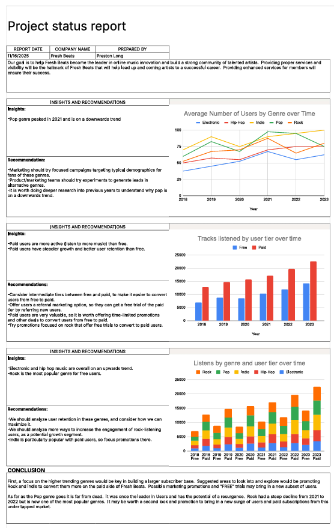
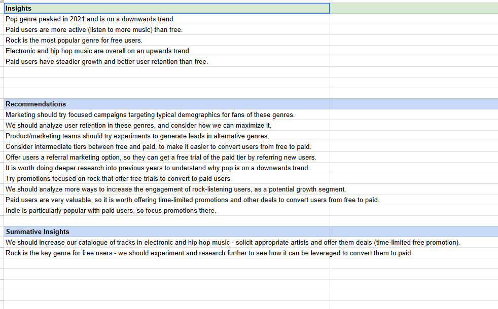

# 🎶 Fresh Beats – Business Intelligence Analytics Report  
### Genre Trends, User Engagement & Subscription Strategy

---

## 📌 Executive Overview

This project presents a stakeholder-focused Business Intelligence analysis for **Fresh Beats**, an online music streaming platform designed to:

- 🎧 Serve music listeners  
- 🎤 Promote emerging artists  
- 💰 Generate revenue through subscriptions and artist promotions  

The objective was to interpret provided insights and visualizations and translate them into actionable strategic recommendations aligned with business growth.

---

# 📊 Project Status & Reporting Structure

The report includes:

- Executive insights and recommendations
- Genre trend analysis over time
- User tier engagement comparison
- Genre performance by subscription level
- A structured conclusion aligned to business strategy

The goal was to connect listening behavior to revenue growth and promotional ROI.

---

# 🎯 Strategic Business Challenges

The analysis focused on three primary priorities:

## 1️⃣ Artist Promotion Effectiveness
- Identify which genres drive the strongest engagement
- Evaluate performance trends over time
- Determine where promotional investment yields highest return

## 2️⃣ User Engagement & Conversion
- Compare behavior of free vs paid users
- Identify drivers of subscription growth
- Analyze retention patterns

## 3️⃣ Genre Promotion Strategy
- Understand which genres are trending upward
- Identify declining categories
- Align emerging artist promotion with demand signals

---

# 📈 Key Insights

## 🎼 Genre Trends

- **Pop peaked in 2021** and is now trending downward.
- **Electronic and Hip-Hop show sustained upward growth.**
- **Rock remains the most popular genre among free users.**

### Interpretation:
Platform momentum is shifting away from traditional pop dominance toward electronic and hip-hop categories.

---

## 👥 User Tier Behavior

- Paid users listen to significantly more music than free users.
- Paid subscriptions show steadier growth and stronger retention.
- Indie is particularly popular among paid subscribers.

### Interpretation:
Engagement intensity strongly correlates with subscription status.

---

## 🔁 Conversion & Retention Observations

- Rock is the dominant genre among free users.
- Paid users demonstrate higher stability across multiple genres.
- Free users represent the largest conversion opportunity.

### Interpretation:
Rock may act as a gateway genre for free-to-paid conversion campaigns.

---

# 💡 Strategic Recommendations

## 🎯 Promotion Strategy

- Increase catalogue depth in **Electronic and Hip-Hop**.
- Offer time-limited promotional deals to artists in high-growth genres.
- Reassess promotional allocation in declining pop category.

---

## 💳 Free-to-Paid Conversion Optimization

- Introduce intermediate subscription tiers.
- Offer referral-based free trials.
- Provide genre-targeted promotions (especially Rock) to free users.
- Deploy time-limited promotional upgrades.

---

## 📊 Growth Segment Expansion

- Target Indie promotions toward paid subscribers.
- Develop campaigns specifically for Rock listeners to encourage paid conversion.
- Run deeper historical analysis to understand pop’s downward trend.

---

# 📌 Executive Conclusion

- Electronic and Hip-Hop represent the strongest future growth opportunities.
- Rock is the key leverage point for converting free users.
- Paid users are highly valuable and should receive retention-focused promotions.
- Genre-based segmentation is critical for maximizing marketing ROI.

Fresh Beats can strengthen both engagement and subscription revenue by aligning promotional investments with genre growth trends and user-tier behavior.

---

# 🛠 Tools & Skills Demonstrated

- Business Intelligence reporting
- Trend analysis over time
- User segmentation strategy
- Insight synthesis for stakeholders
- Executive-level storytelling with data
- Strategic recommendation development

---

# 🧠 What This Project Demonstrates

- Ability to translate visual insights into business strategy
- Strong understanding of engagement-to-revenue relationships
- Structured stakeholder communication
- Strategic thinking in subscription-based business models

---

## 👤 Author

**Preston Long**  
Business Intelligence Analyst  
LinkedIn: [Preston Long](https://www.linkedin.com/in/preston-long-05555539b/)
