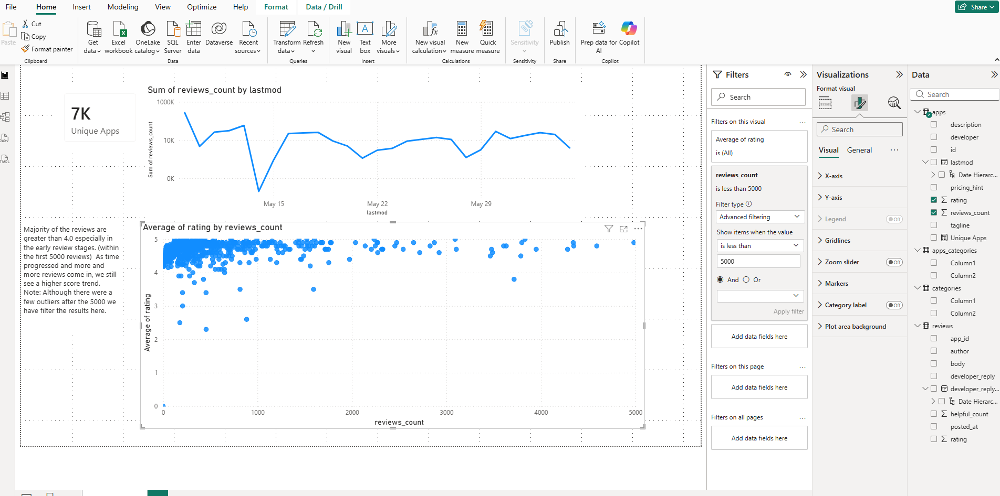
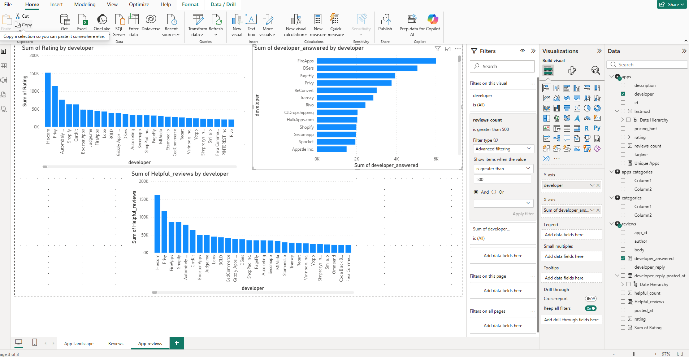

# 🛍️ Shopify App Marketplace Analysis  
### Power BI | App Landscape • Review Quality • Developer Responsiveness

---

## 📌 Project Overview

In this project, I analyzed publicly scraped Shopify App Store data to identify the key factors that contribute to app success. Using Power BI, I built a multi-page report exploring marketplace scale, review behavior, rating stability, and developer responsiveness.

Each numbered section of the assignment corresponds to a dedicated Power BI report page. Every question is represented by a visualization, with screenshots captured to demonstrate build steps and analysis.

---

## 📂 Dataset

**File:** `shopify.xlsx`

The dataset contains four tables:

- **apps** — App-level metadata (developer, rating, reviews_count, lastmod, etc.)
- **apps_categories** — Bridge table connecting apps to categories
- **categories** — Category lookup table (apps can belong to multiple categories)
- **reviews** — Review-level data (rating, comment, helpful_count, developer_reply)

---

# 1️⃣ App Landscape  
*(Report Page: App Landscape)*

## ✅ KPI: Unique Apps

Created a KPI Card showing the **unique count of apps** in the Shopify marketplace dataset.

---

## ✅ Review Volume Over Time

Built a Line Chart:

- **Y-axis:** Sum of `reviews_count`
- **X-axis:** `lastmod` (used as a date value — NOT Date Hierarchy)

This visual highlights review activity trends across time.

---

## ✅ Rating vs Review Volume (Scatterplot)

Created a scatterplot to test whether higher review volume correlates with higher ratings:

- **X-axis:** `reviews_count`
- **Y-axis:** Average `rating`



### 🔎 Interpretation

- Most apps cluster above a **4.0 rating**
- Early-stage apps (low review counts) show greater rating volatility
- Ratings appear more stable after apps accumulate significant review volume

---

# 2️⃣ Reviews  
*(Report Page: Reviews)*

## ✅ Helpful Review Score (DAX)

To weight review quality by helpfulness, I created a calculated column in the **Reviews** table:

```DAX
helpful_reviews = reviews[rating] * (1 + reviews[helpful_count])
```

This multiplies the review rating by one plus the helpful count to amplify high-rated, helpful reviews.

I then created a **Card visual** showing the **average helpful_reviews value**.

---

## ✅ Developer Responded Flag (DAX)

To measure developer responsiveness, I created a binary calculated column:

```DAX
developer_answered =
IF(
    ISBLANK(reviews[developer_reply]),
    0,
    1
)
```

- Returns **1** if a developer replied
- Returns **0** if no reply exists

---

## 📊 Responsiveness vs Rating Analysis

Created a scatterplot comparing:

- **X-axis:** `developer_answered` (0 / 1)
- **Y-axis:** Average `rating`

This tests whether developer responsiveness is associated with higher customer ratings.



---

# 3️⃣ App Reviews  
*(Report Page: App Reviews)*

## ✅ Relationship Created (Data Model)

In the Power BI Data Model, I created a relationship:

- `reviews[app_id]` → `apps[id]`
- Relationship Type: **Many (Reviews) to One (Apps)**

This enables app-level and developer-level aggregation of review metrics.

---

## ✅ Developer-Level Visuals

### 1️⃣ Developer vs Sum of Rating

Bar chart:
- **X-axis:** Developer
- **Y-axis:** Sum of `rating`

⚠️ This metric can be misleading because high totals may reflect high review volume rather than high quality.

---

### 2️⃣ Developer vs Average Helpful Review Score

Bar chart:
- **X-axis:** Developer
- **Y-axis:** Average `helpful_reviews`

This provides a stronger quality indicator than raw rating totals.

---

### 3️⃣ Most Responsive Developers

Bar chart:
- **X-axis:** Developer
- **Y-axis:** Sum of `developer_answered`

**Visual-level filter applied:**
- `reviews_count > 500`

This ensures responsiveness comparisons are based on meaningful review volume.

---

# 🔎 Key Findings

- Most Shopify apps maintain ratings above 4.0
- Rating stability increases with review volume
- Raw rating totals can misrepresent quality
- Helpfulness-weighted scoring provides a stronger evaluation signal
- Developer responsiveness can be quantified and compared

---

# 💡 Recommendations

- Use helpful-weighted review metrics to evaluate app quality more reliably than totals
- Track developer responsiveness as a customer experience signal (support + trust)
- When evaluating apps or developers, combine:
  - Review volume
  - Average rating
  - Helpful-weighted score
  - Responsiveness rate

---

# 🛠 Tools & Skills Demonstrated

- Power BI multi-page report development
- Data modeling (relationships & cross-table analysis)
- DAX calculated columns
- KPI creation
- Trend analysis & scatterplot evaluation
- Visual-level filtering for meaningful comparisons
- Business insight communication

---

# 👤 Author

**Preston Long**  
Business Intelligence Analyst  
LinkedIn: [Preston Long](https://www.linkedin.com/in/preston-long-05555539b/)
