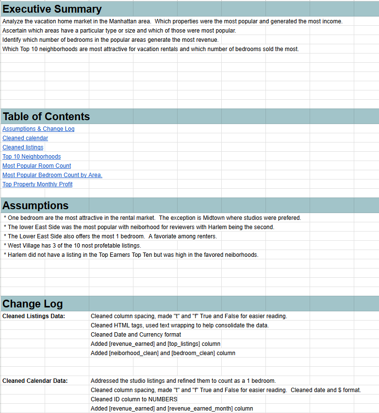
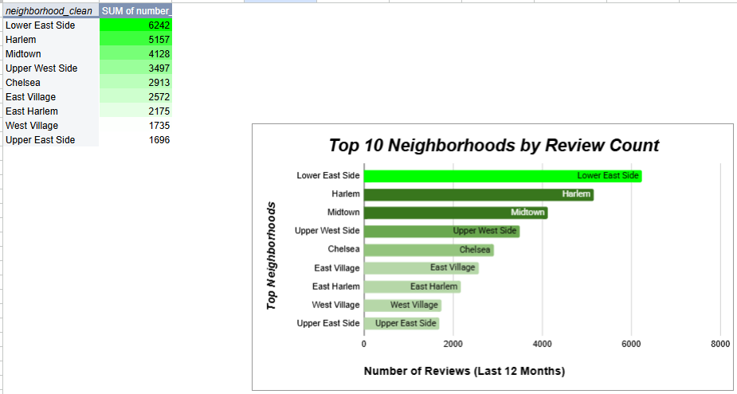
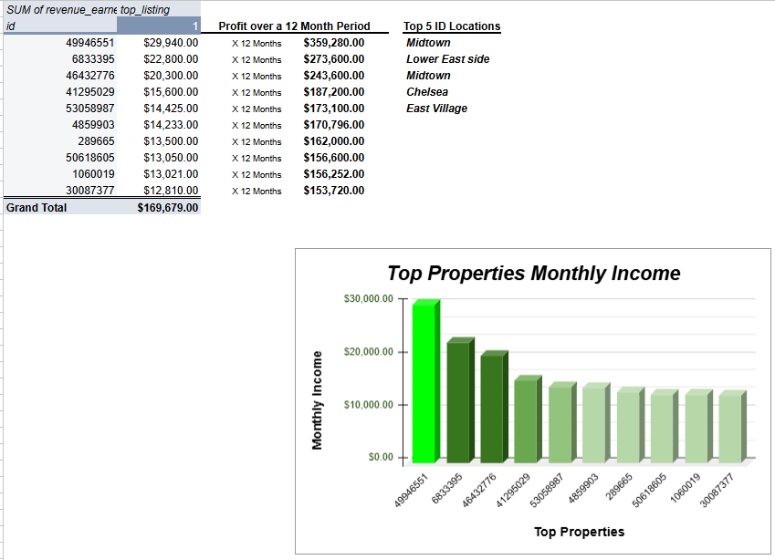
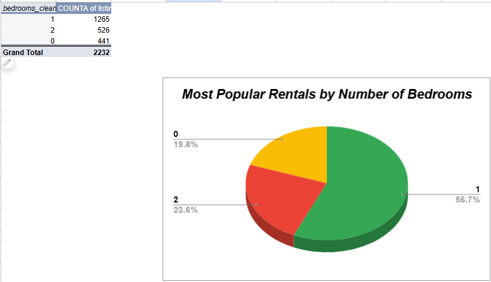
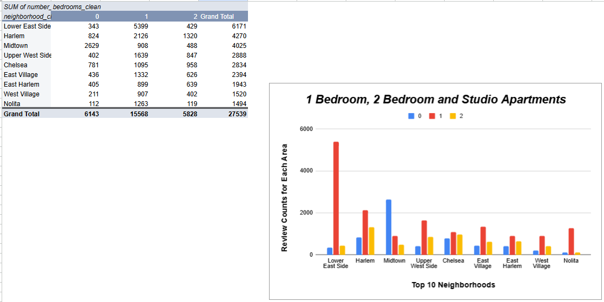
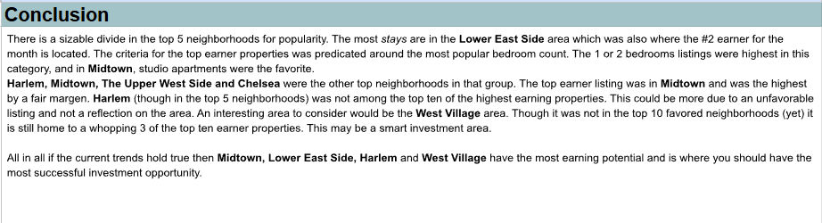

# 🏙️ Manhattan Vacation Rental Market Analysis  
### Business Intelligence Project | Spreadsheet Data Analysis

---

## 📌 Project Overview

This project analyzes the **Manhattan vacation rental market** to determine:

- Which neighborhoods are most attractive for vacation rentals  
- Which property sizes (number of bedrooms) are most popular  
- Whether different neighborhoods prefer different property sizes  
- How much revenue the top-performing listings generate  

The analysis was conducted using structured data cleaning, pivot tables, revenue modeling, and documented transformation steps.

---

# 📊 Executive Summary & Documentation Structure

The workbook includes:

- A structured executive summary
- Clear assumptions documentation
- A change log detailing cleaning steps
- Separate sheets for raw data, cleaned data, and analysis

All transformations were documented to ensure transparency and reproducibility.

---

# 🏘️ Top 10 Most Attractive Neighborhoods

Attractiveness was measured using **reviews in the last 12 months (number_of_reviews_ltm)** as a proxy for rental frequency.

### 🔎 Key Findings

| Rank | Neighborhood | Reviews (LTM) |
|------|--------------|---------------|
| 1 | Lower East Side | 6,242 |
| 2 | Harlem | 5,157 |
| 3 | Midtown | 4,128 |
| 4 | Upper West Side | 3,497 |
| 5 | Chelsea | 2,913 |

**Insight:**
The Lower East Side leads significantly in rental demand, with Harlem and Midtown close behind.

---

---

# 🛏️ Most Popular Rental Sizes (Overall)

### Distribution of Bedroom Counts

- **1 Bedroom → 56.7%** (Most Popular)
- 2 Bedrooms → 23.6%
- Studios (0 Bedrooms) → 19.8%

### Insight

One-bedroom units dominate the Manhattan rental market and represent the safest investment strategy across most neighborhoods.

---

# 🏘️ Bedroom Preferences by Neighborhood

### Key Observations

- All top neighborhoods favor **1-bedroom listings**
- **Midtown is the exception**, where studio apartments are preferred
- Lower East Side shows the strongest 1-bedroom dominance
- Harlem remains strong across both 1-bedroom and 2-bedroom units

This reflects likely traveler segmentation:
- Midtown → short-term business travelers
- Lower East Side & Harlem → longer leisure stays

---

# 💰 Revenue Analysis – Top Performing Listings

Revenue was calculated by:

- Summing 30-day rental income from the calendar dataset  
- Annualizing revenue (30-day revenue × 12 months)  
- Filtering for top listings within top neighborhoods  

### 🔝 Highest Annualized Earners

- Top listing estimated at **$359,280 annually**
- Other high performers ranged from **$273,600 to $153,720 annually**

### Revenue Insights

- Midtown dominates top earners
- Lower East Side maintains strong demand volume
- West Village, though not top in reviews, hosts multiple high-income listings

This suggests:
Popularity ≠ Maximum revenue potential.

---

# 📈 Strategic Conclusions

### Core Takeaways

- Lower East Side is the most active rental market
- Midtown generates the highest income properties
- 1-bedroom units are the safest and strongest performers
- Studios perform best in Midtown specifically
- West Village may present emerging premium opportunity

---

# 🚀 Business Recommendations

### 1️⃣ Investment Focus
Prioritize acquisitions in:
- Midtown  
- Lower East Side  
- Harlem  
- West Village (emerging high-income cluster)

---

### 2️⃣ Property Size Strategy
Focus primarily on:
- 1-bedroom units  
- Midtown studios for short-term high-margin stays  

---

### 3️⃣ Revenue Optimization
- Analyze pricing models of top 10 earners  
- Identify amenities driving premium pricing  
- Optimize mid-tier listings for yield improvement  

---

# 🛠 Tools & Skills Demonstrated

- Excel Pivot Tables  
- Data Cleaning & Standardization  
- IF() logic and conditional cleaning  
- SUMIF() revenue modeling  
- Annual revenue forecasting  
- Neighborhood segmentation analysis  
- KPI modeling and ranking  
- Executive-ready reporting  

---

# 🧠 What This Project Demonstrates

- Ability to transform raw listing + calendar data into structured insights  
- Clear connection between demand signals and revenue potential  
- Structured documentation of data cleaning processes  
- Investment-focused strategic recommendations  
- Strong business interpretation of quantitative analysis  

---

## 👤 Author

**Preston Long**  
Business Intelligence Analyst  
LinkedIn: [Preston Long](https://www.linkedin.com/in/preston-long-05555539b/)

---

