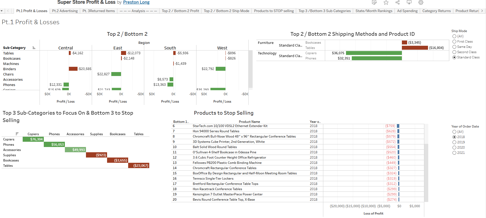
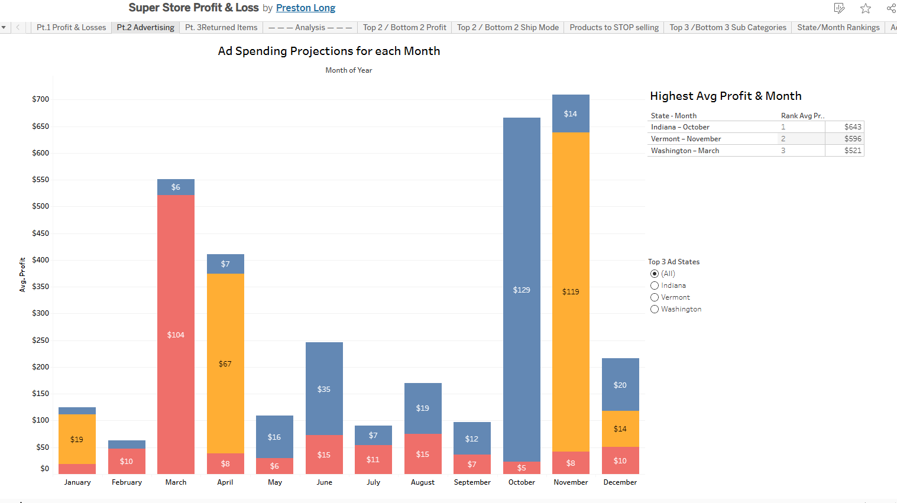

# 🛍️ Saving SuperStore  
### Tableau Profitability, Advertising & Returns Analysis

---

## 📊 Project Overview

The SuperStore is experiencing declining profitability and potential financial instability.  
As a consultant, I was tasked with identifying:

- Major profit centers and loss drivers  
- Products and subcategories to discontinue  
- Strategic advertising opportunities  
- Return rate risks impacting margins  

All recommendations are supported with Tableau visualizations and financial analysis.

---

# 📈 1️⃣ Profit & Loss Analysis

## 🔎 Key Findings

### ✅ Top Profit Centers
- **Copiers**
- **Phones**
- **Accessories**

These categories generate strong positive margins across regions.

### ❌ Major Loss Drivers
- **Tables**
- **Bookcases**
- **Supplies**

Furniture (especially Tables) consistently generates losses across multiple regions.

### 🚫 Products to Stop Selling
Multiple SKUs show persistent negative profit across years and regions.  
Examples include conference tables and specialty bookcases.

### 🎯 Recommendation
- Scale high-margin technology categories  
- Reduce exposure to loss-making furniture  
- Eliminate chronically negative SKUs  

---

# 📢 2️⃣ Advertising Strategy

Advertising must be driven by **Return on Ad Spend (ROAS)**.

## 🏆 Top State + Month Combinations

| State      | Best Month  | Avg Profit |
|------------|------------|------------|
| Indiana    | October    | ~$643 |
| Vermont    | November   | ~$596 |
| Washington | March      | ~$521 |

### 💰 Ad Spend Rule
For this analysis:
> Willing to spend **20% of average profit** on advertising.

Example:
- Indiana (October): $643 avg profit  
- Recommended max ad spend: ~$129  

### 🎯 Recommendation
- Target advertising geographically and seasonally  
- Avoid blanket campaigns  
- Focus on historically high-margin months  

---

# 🔁 3️⃣ Returns & Profit Risk Analysis

## 🔎 Key Findings

### 🚨 High Return Products
Certain printers, phones, and specialty items show extremely high return rates (some near 100%).

### 👤 High-Risk Customers
Several customers demonstrate return rates above 80%, reducing profitability significantly.

### 📊 State-Level Risk
Some states combine:
- Low profit
- High return rate

These markets require operational review.

---

# 💡 Executive Recommendations

## 1️⃣ Eliminate Persistent Loss SKUs
Remove chronically unprofitable products.

## 2️⃣ Reevaluate Furniture Strategy
Tables and Bookcases show structural margin issues.

## 3️⃣ Implement Targeted Advertising
Focus on:
- Indiana (October)
- Vermont (November)
- Washington (March)

## 4️⃣ Reduce Return Risk
- Audit high-return SKUs  
- Review supplier quality  
- Tighten return policy for repeat offenders  

---

# 🛠 Skills Demonstrated

- Tableau Dashboard Development  
- Profit Decomposition Analysis  
- Dimensional Profit Segmentation  
- ROAS Modeling  
- Return Rate Calculations  
- LEFT JOIN Data Modeling  
- Executive Storytelling with Data  

---

# 📂 Repository Structure

---

---

# 🧠 What This Project Demonstrates

- Ability to diagnose financial risk
- Profitability segmentation skills
- Advertising investment modeling
- Return behavior analysis
- Strategic decision-making using visualization
- Business-first thinking

---

## 👤 Author

**Preston Long**  
Business Intelligence Analyst  
LinkedIn: [[Preston Long](https://www.linkedin.com/in/preston-long-05555539b/)]  

---
