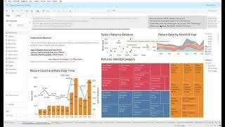
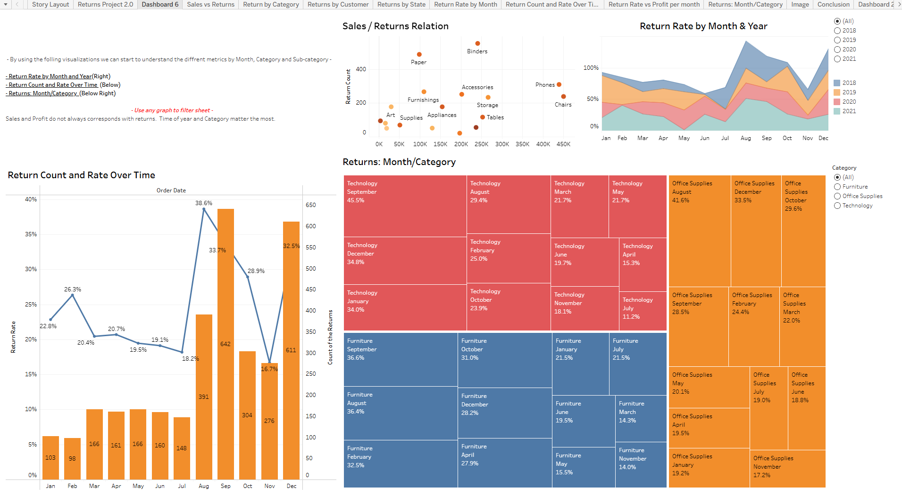
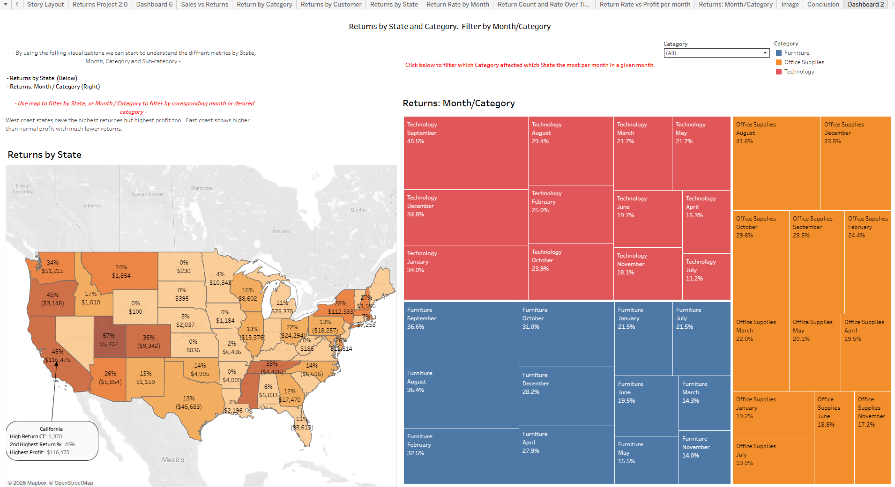

## 🎥 Project Walkthrough

)

# 📦 Superstore Returns Analysis  
### Storytelling with Data | Tableau Dashboard Project

---

## 📌 Executive Summary

The Superstore has experienced a high volume of returned orders, impacting profitability and operational efficiency.

This project was developed for the CEO to:

- Identify root causes of returns  
- Determine whether returns are driven by sales volume, geography, product category, or time  
- Design a monitoring dashboard for executive decision-making  
- Propose strategic actions to reduce return rates  

The analysis was performed using Tableau with structured joins, calculated fields, and interactive dashboard design.

---

# 🔍 How Returns Were Measured

The **Returns** table was LEFT JOIN’ed to the Orders table.

A calculated field was created:

- Returned = 1 if "Yes"
- Returned = 0 if null

From this:

- **Return Rate = AVG(Returned)**
- **Total Returns = SUM(Returned)**
- **Return Volume = COUNT(Returned)**

Each metric serves a different purpose:

| Metric | Best Used When |
|--------|---------------|
| Return Rate | Comparing risk across segments |
| Total Returns | Measuring operational burden |
| Total Cost of Returns | Measuring financial impact |

---

# 📊 Root Cause Analysis

---

## 1️⃣ Sales vs Returns Correlation

A scatterplot was created aggregating by **product subcategory**.

### 🔎 Findings

- Sales do not always correlate positively with returns.
- Some high-sales subcategories show moderate return rates.
- Others (e.g., certain furniture categories) generate disproportionate return counts relative to profit.
- Time of year and category matter more than pure sales volume.

**Conclusion:**  
High sales alone do not cause returns. Product mix and category behavior are stronger drivers.

---

## 2️⃣ Geographic Concentration of Returns

A map and monthly/category breakdown revealed:

### 🔎 Findings

- West Coast states show higher return rates.
- Some East Coast states show higher profits but lower return percentages.
- California had the highest return count and second-highest return rate.
- Seasonal spikes occur in late summer and early fall.

**Conclusion:**  
Returns are geographically concentrated and show seasonal patterns.

---

## 3️⃣ Return Rate by Product Category

Key Observations:

- Technology shows high return spikes in specific months.
- Office Supplies maintain moderate but consistent return rates.
- Furniture categories show volatility depending on month and region.

This suggests product handling, expectations, or quality issues in specific categories.

---

## 4️⃣ Return Rate by Customer

To identify problematic behavior:

- Customers with only one order were excluded.
- Repeat customers were analyzed for return tendencies.

Findings:

- A small subset of customers have significantly elevated return rates.
- Repeat high-return customers may require policy review.

---

## 5️⃣ Return Rate Over Time

Monthly analysis showed:

- Significant spikes in August and September.
- Lower return rates early in the year.
- Clear seasonal pattern tied to purchasing cycles.

---

# 📊 Composite Analysis (Multi-Factor Views)

Two composite visualizations were created combining:

- Month + Category
- State + Category

These views helped isolate:

- Which categories spike in which states
- Which months amplify return risk
- Whether geographic patterns are category-specific

---

# 🖥️ Dashboard Development

## 1️⃣ Low-Fidelity Mockups

Three dashboard sketches were created to:

- Define layout hierarchy
- Determine KPI placement
- Ensure executive usability

## 2️⃣ Dashboard Template

A Tableau dashboard template was built using container layouts to match the selected mockup.

## 3️⃣ Final Interactive Dashboard

The final dashboard allows executives to:

- Filter by Category
- Filter by Year
- Drill down by State
- Compare Return Rate vs Volume
- Analyze seasonal return patterns

---

# 🎯 Story Arc for Executive Presentation

The final Tableau Story walks through:

1. Summary of return performance
2. How returns should be measured
3. Key geographic and seasonal patterns
4. Product category risk analysis
5. Dashboard demonstration
6. Recommended operational actions

---

# 🚨 Key Root Causes Identified

- Geographic concentration (West Coast)
- Seasonal spikes (late summer)
- Certain subcategories with high volatility
- Repeat high-return customers
- Mismatch between sales volume and return efficiency

---

# 💡 Strategic Recommendations

### 1️⃣ Category Review
Audit high-return subcategories for:
- Product quality issues
- Description accuracy
- Packaging and shipping damage

### 2️⃣ Geographic Targeting
Investigate logistics processes in high-return states.

### 3️⃣ Seasonal Mitigation
Prepare operational adjustments during peak return months.

### 4️⃣ Customer Policy Optimization
Consider monitoring repeat high-return customers.

### 5️⃣ Implement Dashboard Monitoring
Deploy dashboard to leadership for monthly review.

---

# 🛠 Tools & Techniques Demonstrated

- Tableau LEFT JOIN modeling  
- Calculated Fields (binary return flag)  
- Return rate modeling using AVG()  
- Scatterplot correlation analysis  
- Geographic mapping  
- Seasonal trend analysis  
- Multi-factor composite dashboards  
- Executive storytelling with data  

---

# 🧠 What This Project Demonstrates

- Ability to identify root causes beyond surface-level metrics  
- Strong business interpretation of return behavior  
- Dashboard design thinking and mockup planning  
- Executive communication skills  
- Interactive monitoring solution design  

---

## 👤 Author

**Preston Long**  
Business Intelligence Analyst  
LinkedIn: [Preston Long](https://www.linkedin.com/in/preston-long-05555539b/)
