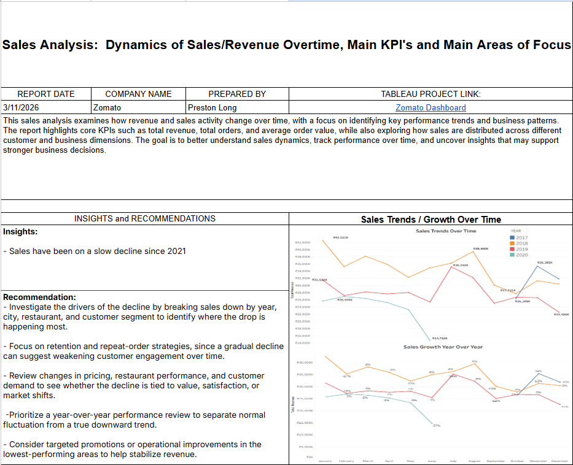
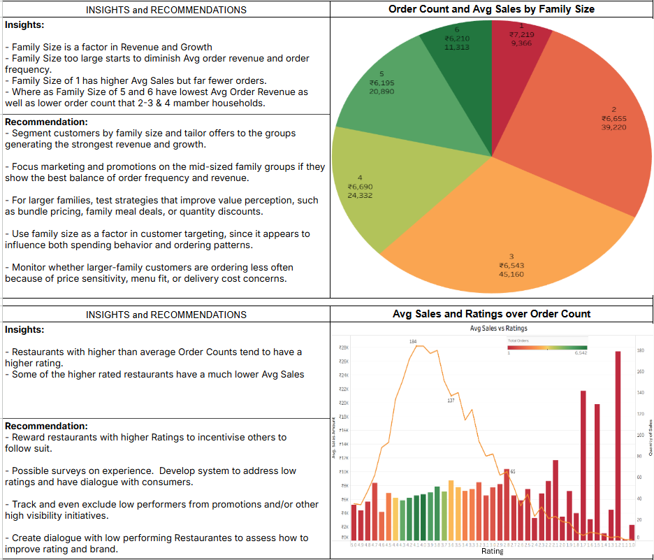
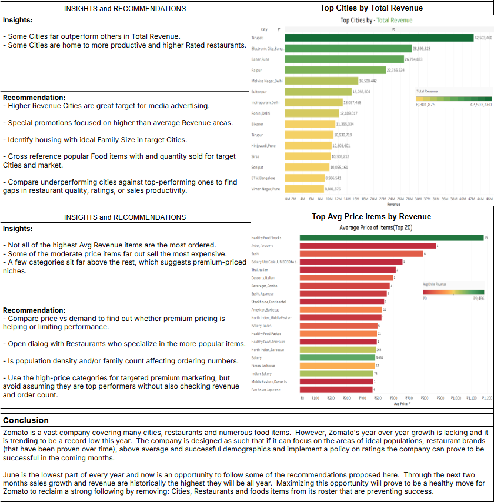
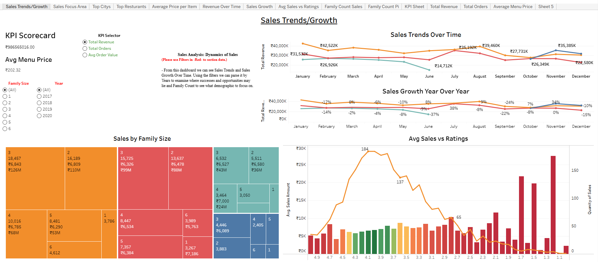
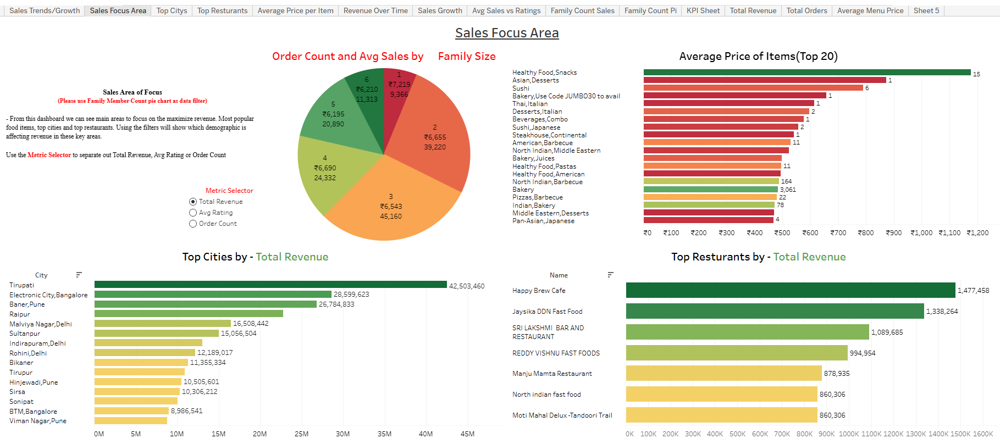

# 🍽️ Zomato Sales Analysis  
### Business Intelligence Final Project | Sales Trends, KPI Performance & Focus Areas

---

## 📌 Project Overview

As a Junior Business Analyst for **Zomato**, I was tasked with analyzing restaurant and customer performance using test datasets from the platform. The goal of this project was to evaluate **sales and revenue dynamics over time**, identify the most important **KPIs**, and uncover the main business areas that deserve focus.

This analysis was structured as a stakeholder-facing report supported by interactive dashboard views. The project combines trend analysis, KPI tracking, customer segmentation, city performance, pricing patterns, and restaurant-level insights to support stronger business decisions.

---

## 🎯 Business Problem

Zomato needs to better understand:

- How sales and revenue are changing over time
- Which customer and restaurant segments drive the strongest performance
- Which cities are creating the most value
- Whether pricing, ratings, and order behavior are aligned with revenue growth
- What actions could help reverse slowing year-over-year growth

---

## 🧰 Tools Used

- Tableau
- Excel / Spreadsheet-based business analysis
- KPI analysis
- Trend analysis
- Segmentation analysis
- Executive reporting

---

## 📊 Report Overview

The project was summarized in a multi-page business report. The pages below present the findings in sequence.

---

## 📈 Interactive Dashboard Views

To complement the write-up, I built dashboard views to explore sales growth, focus areas, city performance, family-size behavior, pricing, and restaurant performance.

---

## 🔎 Key Findings

### 1️⃣ Sales have been trending downward since 2021
The report shows a gradual decline in sales growth after 2021. While monthly performance still fluctuates, the broader trend suggests weakening momentum.

**Business meaning:**  
This may point to softening customer demand, weaker repeat behavior, pricing pressure, or reduced performance in certain cities and restaurant segments.

---

### 2️⃣ Family size is a meaningful driver of revenue and order behavior
Customer family size is closely tied to both order count and sales performance.

Key patterns observed:
- Mid-sized family groups generate the strongest overall revenue and order activity
- Family size **1** has relatively high average sales but much lower order volume
- Larger households begin to show weaker average order value and lower ordering frequency in some cases

**Business meaning:**  
Different household sizes appear to behave differently, suggesting that promotions, bundles, and menu offers should be tailored by segment.

---

### 3️⃣ Higher order-count restaurants tend to have stronger ratings
The analysis indicates that restaurants with above-average order counts often also have better ratings.

However:
- Some highly rated restaurants still have relatively low average sales
- Strong ratings alone do not guarantee stronger revenue performance

**Business meaning:**  
Ratings matter, but they should be analyzed alongside visibility, demand, pricing, and operational execution.

---

### 4️⃣ Revenue is concentrated in a small number of cities
Certain cities dramatically outperform others in total revenue.

Examples from the dashboard include top-performing cities such as:
- Tirupati
- Electronic City, Bangalore
- Baner, Pune
- Raipur

**Business meaning:**  
Revenue concentration suggests that some markets are significantly more mature or productive, while others may be underperforming and need targeted improvement strategies.

---

### 5️⃣ High price does not always equal high demand
The pricing analysis shows that some of the highest average-priced items are not necessarily the most ordered.

At the same time:
- Some moderately priced categories perform very well
- A few premium categories appear to occupy strong niche positions

**Business meaning:**  
Premium pricing can work, but only when supported by strong demand, positioning, and perceived value.

---

## 🧭 Focus Areas Identified

Based on the report and dashboard findings, the main areas of focus are:

- Reversing the gradual decline in sales growth
- Strengthening customer targeting by family size
- Improving performance in weaker cities
- Supporting low-performing but high-visibility restaurants
- Reviewing premium pricing strategies against actual demand
- Aligning ratings, order frequency, and revenue more effectively

---

## 💡 Recommendations

### ✅ 1. Investigate the decline by segment
Break sales down by:
- Year
- City
- Restaurant
- Customer family size

This will help isolate where the decline is happening most strongly.

---

### ✅ 2. Build targeted strategies by family size
Use family size as a segmentation variable for:
- Bundled pricing
- Family meal deals
- Promotions
- Quantity discounts

This is especially relevant for mid-sized groups, which appear to provide the strongest balance of order count and revenue.

---

### ✅ 3. Focus on retention and repeat-order behavior
A gradual decline over time may indicate weakening engagement. Zomato should monitor:
- Repeat ordering patterns
- Customer churn risk
- Frequency changes by household type and city

---

### ✅ 4. Prioritize top-performing cities while fixing weak markets
High-revenue cities are strong candidates for:
- Media investment
- Restaurant acquisition
- Promotional campaigns

At the same time, underperforming cities should be compared directly against top cities to identify performance gaps in:
- Restaurant quality
- Ratings
- Order productivity
- Pricing mix

---

### ✅ 5. Reassess restaurant visibility and promotional support
Because some restaurants have strong ratings but weaker sales, Zomato should consider:
- Visibility improvements
- Better promotional placement
- Restaurant coaching or outreach
- Stronger performance monitoring tied to both ratings and sales

---

### ✅ 6. Evaluate premium pricing more carefully
Before assuming high-price items are top performers, compare:
- Price
- Quantity sold
- Total revenue contribution
- Category demand

Premium-priced items may be useful for targeted niche marketing, but should not be treated as top performers without revenue validation.

---

## 📌 Business Conclusion

This analysis suggests that Zomato remains a strong platform with valuable city, restaurant, and customer segments, but overall growth is beginning to weaken. The most important opportunity is not simply to chase top-line sales, but to better understand **where performance is strongest, where it is slipping, and which segments are worth deeper investment**.

The project points to several practical levers for improvement:

- Segment customers more intelligently
- Focus on high-value cities
- Improve restaurant performance where visibility is high but sales are weak
- Use pricing and family-size behavior more strategically
- Monitor trends year-over-year to distinguish normal fluctuation from true decline

---

## 🛠️ Skills Demonstrated

- Business Intelligence reporting
- KPI development and interpretation
- Trend analysis over time
- Customer segmentation
- City and restaurant performance analysis
- Pricing analysis
- Dashboard storytelling
- Stakeholder-oriented recommendations

---

## 🧠 What This Project Demonstrates

This project demonstrates my ability to:

- Translate business questions into structured analysis
- Connect dashboard findings to strategic recommendations
- Interpret multiple dimensions of performance at once
- Build executive-facing analytics deliverables
- Think beyond charts and focus on business action

---

## 👤 Author

**Preston Long**  
Business Intelligence Analyst  
LinkedIn: [Preston Long](https://www.linkedin.com/in/preston-long-05555539b/)
